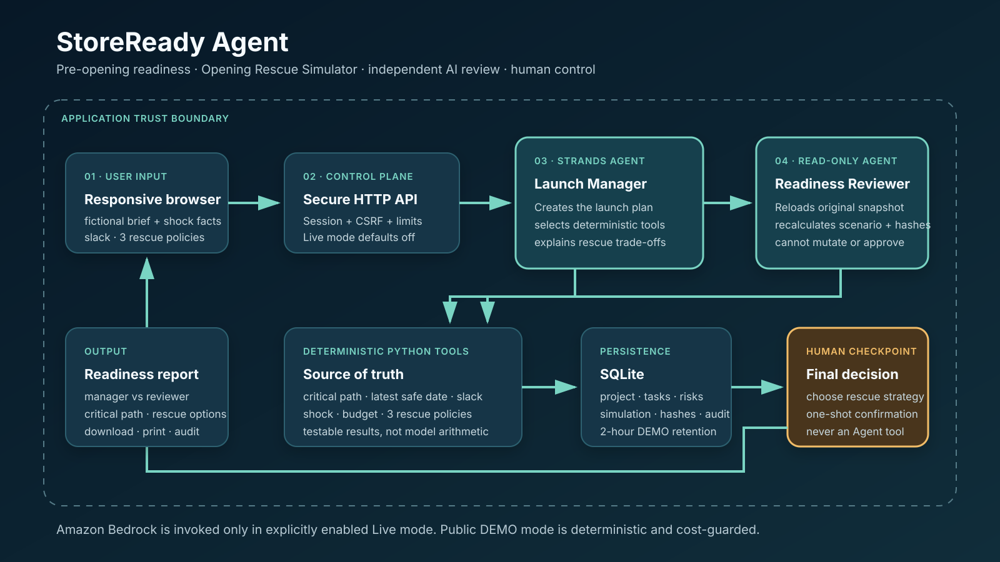

# StoreReady Agent Architecture



The diagram asset is a standalone SVG suitable for the public repository, Devpost images, and the demonstration video.

```text
Responsive Browser UI (HTML / CSS / JavaScript)
    |
    v
HTTP API (stdlib server) ----> SQLite
    |
    +--> Deterministic readiness service
    |       +--> workdays / dependencies / critical path
    |       +--> earliest completion / latest safe date / slack
    |       +--> documents / budget / training gaps
    |       +--> readiness score
    |       +--> immutable shock / three rescue policies / hashes
    |
    +--> Launch Manager Agent (Strands + Bedrock)
            |
            +--> create_launch_plan
            +--> calculate_critical_path
            +--> detect_readiness_gaps
            +--> simulate_opening_rescue
            +--> readiness_reviewer (Agent-as-Tool)
                              |
                              +--> independent read-only calculations
                              +--> independent rescue recomputation + hash check
                              +--> generate_readiness_report
```

## Responsibility boundary

- The deterministic service owns dates, workdays, dependencies, budgets, gaps and scores.
- Opening Rescue Simulator owns CPM slack, latest safe dates, shock propagation and the
  three fixed recovery-policy outcomes. Human-supplied recovery capacity and quotes are
  facts; missing values block unsafe choices instead of being estimated.
- Launch Manager interprets the fictional user brief, selects tools and requests review.
- Readiness Reviewer re-reads the original project data, recalculates independently and cannot write state.
- Human decisions are application-service operations only; `record_decision` is not exposed as a model tool.
- SQLite stores the project, tasks, dependencies, documents, budget, findings, approvals,
  immutable rescue snapshots and hashes, one-shot human strategy choices, audit events and reports.
- The product UI accepts all eight brief fields and renders progress, metrics, risks, dependencies, Agent comparison, approvals, Audit Log and report exports.
- No real customer data, payment, external messaging, government submission or automatic approval is included.

## Security boundary

The live layer uses the standard AWS credential chain. Secrets are never printed,
persisted, or accepted through chat. Missing credentials stop the preflight with
`P0_CREDENTIALS_REQUIRED`.

- `opening_date` is a hard deadline. The deterministic planner schedules backward over weekdays and marks every task on the longest dependency chain.
- Opening dates are bounded to 2000-01-01 through 2100-12-31 before scheduling, preventing date arithmetic overflow.
- Missing budget details never become a hidden 0% budget score. The result is marked provisional and the known task, document and risk components are reweighted to 100% while budget totals remain unknown.
- Reviewer tools reconstruct their inputs from an immutable JSON snapshot containing only original fictional input; Manager calculations are not accepted as Reviewer input.
- Manager is capped at 6 model cycles, Reviewer at 5, each model output at 1,024 tokens, one controlled tool retry, and the whole invocation at 120 seconds.
- Live evidence stores versions, model, region, tool IDs, status, latency, output hashes, token totals and stop reasons, but never raw prompts, model output, AWS identity or credentials.
- Request bodies are capped at 64 KiB and serialized Agent input at 16 KiB.
- Mutation APIs require a same-site browser session and CSRF token. Report and Audit API reads require the project-owning session. Human decisions are one-shot.
- Rescue source JSON includes schema/version plus complete project and task/dependency
  state. Server-side source, shock and result SHA-256 mismatch fails closed before a
  strategy can be selected. A simulation never overwrites the baseline report.
- Browser code renders untrusted values through `textContent`; CSP blocks inline/external third-party scripts, framing, objects and unauthorized connections.
- `STORE_READY_ENABLE_LIVE=1` is required before any Live endpoint can invoke Bedrock. Public noindex DEMO deployment leaves it disabled; noindex is not access control.
